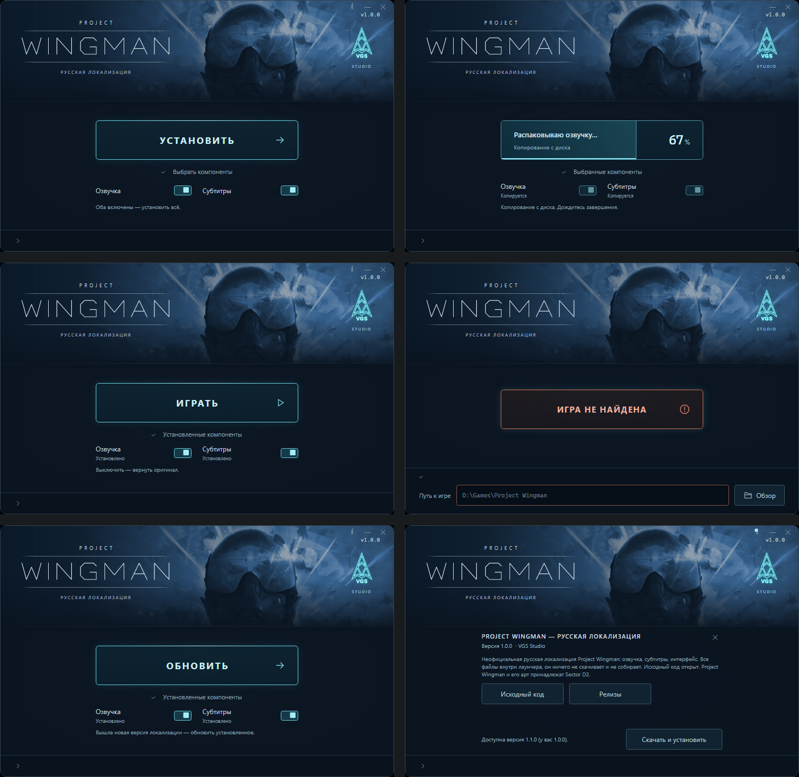

# Project Wingman — русская локализация

Полная русская локализация Project Wingman от VGS Studio: озвучка, субтитры и интерфейс.
Лаунчер ставит её в пару кликов и так же убирает.

**Скачать:** [последний релиз](https://github.com/RikudoSmpai/PWRuLauncher/releases/latest) → `PWRuLauncher.exe`.

## Как поставить

1. Скачайте `PWRuLauncher.exe` и запустите. Устанавливать ничего не нужно: всё уже внутри файла.
2. Лаунчер сам найдёт игру (Steam, GOG, любая другая копия). Если не нашёл, раскройте стрелку внизу окна
   и укажите папку игры.
3. Нажмите «Установить». Файлы копируются с диска, интернет не нужен.
4. «Играть».

Под кнопкой есть «Выбрать компоненты»: озвучка и субтитры (субтитры включают перевод интерфейса).
После установки выключение компонента возвращает оригинальные файлы игры.

Требования: Windows 10 или 11. Больше ничего ставить не надо.

## Почему это безопасно

- **Исходный код открыт.** Это он и есть, весь, в этом репозитории.
- **Каждый релиз собирается на GitHub Actions** из этих исходников по тегу, а не на чьём-то компьютере.
  Что в релизе, то и в коде. Рядом с exe лежит его контрольная сумма `PWRuLauncher.exe.sha256`.
- **Ничего не качает и не собирает.** Все файлы локализации уже внутри exe. Регистрации нет, данные о вас
  никуда не отправляются. Единственное обращение в интернет: проверка, вышла ли новая версия, и
  скачивание обновления, если вы сами нажмёте кнопку.
- **Файлы игры не переписываются**, кроме одного: интро-ролика. Его оригинал сохраняется рядом
  (`HumbleIntro_PW.mp4.pwru-orig`) и возвращается при удалении локализации. Остальное кладётся отдельными
  файлами и убирается вместе с ней.
- **Steam, достижения и защита игры не затрагиваются.** Игра запускается через Steam как обычно.

Windows SmartScreen может показать «Неизвестный издатель»: exe не подписан платным сертификатом.
Нажмите «Подробнее» → «Выполнить в любом случае». Антивирус может обратить внимание на `dwmapi.dll`
рядом с игрой: это [UE4SS](https://github.com/UE4SS-RE/RE-UE4SS), открытая библиотека для модов на
Unreal Engine, через неё включается русский язык и переводится текст, которого нет в субтитрах.

## Что именно попадает в папку игры

| Файл | Зачем |
|---|---|
| `ProjectWingman\Content\Paks\~mods\PW_RU_Voice.pak` | русская озвучка |
| `ProjectWingman\Content\Paks\~mods\PW_RU_Subs.pak` | субтитры и тексты игры |
| `ProjectWingman\Binaries\Win64\dwmapi.dll`, `UE4SS.dll`, `UE4SS-settings.ini`, папка `Mods\` | UE4SS: русский язык при каждом запуске, перевод текста мимо субтитров, титры локализации |
| `ProjectWingman\Content\Movies\HumbleIntro_PW.mp4` | интро (оригинал рядом в `.pwru-orig`) |

Убрать всё: выключите оба компонента в лаунчере. Или удалите эти файлы руками и верните `.pwru-orig` на место.

## Обновления

Когда выходит новая версия, лаунчер при запуске сам открывает панель «О программе» с кнопкой
«Скачать и установить» (проверить вручную: кнопка «i» в углу окна). Новая версия скачивается с этой
страницы релизов, сверяется с контрольной суммой и заменяет лаунчер. После этого кнопка «Обновить»
переставит локализацию.

## Проблемы

Пишите в [Issues](https://github.com/RikudoSmpai/PWRuLauncher/issues). Если лаунчер не запускается,
приложите `PWRuLauncher.log` из папки, где лежит exe.

## Разработчикам

Сборка, устройство и релизный конвейер описаны в [docs/DEVELOPMENT.md](docs/DEVELOPMENT.md).

---

Неофициальная локализация. Project Wingman и его арт принадлежат Sector D2. Локализация: VGS Studio.
Код лаунчера под лицензией MIT. Сделано с помощью Claude Code (Claude Fable 5.1).
